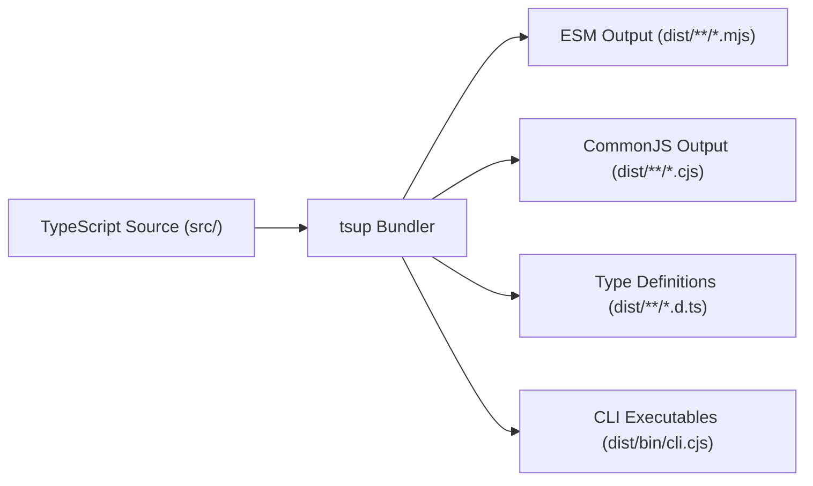

# Package Architecture: @omnidev-tools/json-structured-data

## 1. Overview and Core Philosophy

`@omnidev-tools/json-structured-data` is an enterprise-grade, isomorphic, zero-runtime-dependency TypeScript library and CLI toolset designed for safe, deterministic, and high-performance manipulation of JSON and structured data.

### Core Architectural Principles
1. **Zero Runtime Dependencies**: Every utility is built from foundational algorithms without pulling in third-party runtime code. This ensures zero supply-chain risk, instant cold starts, and minimal bundle footprint.
2. **Security by Default**: Strict prototype pollution defense blocks malicious keys (`__proto__`, `constructor`, `prototype`) across all deep traversal and unflattening paths.
3. **Isomorphic Compatibility**: Operates seamlessly in Node.js (>=18), modern browsers, Cloudflare Workers, Deno, and Bun.
4. **Dual Module Output**: Full ESM (`.mjs`) and CommonJS (`.cjs`) support with precise TypeScript `.d.ts` declaration maps.
5. **Granular Tree-Shaking**: Every utility is exposed as an isolated subpath import (`@omnidev-tools/json-structured-data/safe-parse`), allowing bundlers to package only the exact code used.

---

## 2. Directory and Module Organization

```text
├── package.json               # Package manifests, exports map, CLI definitions
├── tsconfig.json              # Strict TypeScript compiler options
├── tsup.config.ts             # ESM, CJS, and DTS bundling
├── vitest.config.ts           # Vitest unit test & coverage runner
├── docs/                      # Dedicated architectural & usage documentation
└── src/
    ├── index.ts               # Primary bundle re-exporting all tools
    ├── index.test.ts          # Root entrypoint & integration test suite
    ├── shared/
    │   ├── types.ts           # JSON primitives and generic types
    │   ├── security.ts        # Prototype pollution guards and safe record factories
    │   ├── security.test.ts   # Security & prototype pollution unit tests
    │   ├── parser.ts          # Lexical scanner & syntax error position locator
    │   └── parser.test.ts     # Parser diagnostics & error coordinate tests
    ├── safe-parse/            # json-safe-parse implementation & unit tests
    ├── safe-stringify/        # json-safe-stringify implementation & unit tests
    ├── formatter/             # json-formatter implementation & unit tests
    ├── minify/                # json-minify implementation & unit tests
    ├── validator/             # json-validator implementation & unit tests
    ├── diff/                  # json-diff implementation & unit tests
    ├── flatten/               # json-flatten implementation & unit tests
    ├── unflatten/             # json-unflatten implementation & unit tests
    ├── path/                  # json-path implementation & unit tests
    ├── version.ts             # Compile-time package version synchronization
    ├── version.test.ts        # Version synchronization unit test
    └── bin/
        ├── cli.ts             # CLI command runner & argument parser
        └── cli.test.ts        # CLI integration test suite
```

---

## 3. Subsystem Architecture

### 3.1 Lexical Scanner & Diagnostic Parser (`shared/parser.ts`)
Standard V8 and browser `JSON.parse` implementations provide varying error messages across versions. In newer V8 engines, syntax errors frequently omit explicit line and column coordinates.

The internal diagnostic scanner performs character-level lexical analysis when an error occurs:
1. It scans tokens (strings, numbers, booleans, arrays, objects) up to the failure point.
2. It calculates the exact 1-indexed line and column offset.
3. It constructs an ASCII context snippet with an arrow indicator (`^`) pointing directly to the offending character.

### 3.2 Security Layer (`shared/security.ts`)
Object reconstruction and deep property setting are common vectors for Prototype Pollution attacks. The security layer enforces:
- Explicit blacklisting of `__proto__`, `prototype`, and `constructor`.
- Prototype pollution guards inside `unflattenJson` and `setPath`.
- Clean prototype-free dictionary creation (`Object.create(null)`).

### 3.3 Circular Reference & Type Transform Engine (`safe-stringify`)
Uses a `Set` traversal tracker:
- When an object reference is encountered that is already in the active ancestor stack, it substitutes the reference with `[Circular]` (or user-defined placeholder).
- Automatically converts non-JSON primitive types (`BigInt`, `Map`, `Set`, `Error`, `RegExp`) into standard JSON representations.
- Enforces a recursion limit (`maxDepth`) to protect against stack overflows in pathological object graphs.

### 3.4 Deep Structural Diff Engine (`diff`)
Recursively explores both left and right objects/arrays:
- Distinguishes between additions, removals, and modifications.
- Produces normalized path strings conforming to JavaScript property access notation (e.g. `users[2].address.city`).
### 3.5 Version Synchronization & Single Source of Truth (`version.ts`)
The package version is maintained strictly in `package.json`:
- `tsup.config.ts` and `vitest.config.ts` dynamically read `package.json` at build and test time, injecting `__PACKAGE_VERSION__`.
- The CLI (`src/bin/cli.ts`) and root library exports (`src/index.ts`) consume `VERSION` directly, eliminating any manual file edits when bumping versions.

---

## 4. Build and Distribution Pipeline



The build process uses `tsup` (backed by `esbuild`) to simultaneously emit:
1. **ESM Modules** for modern bundlers (Vite, Rollup, Webpack 5, Next.js).
2. **CommonJS Modules** for legacy Node.js environments.
3. **Type Declaration Maps** for full IDE autocompletion and type validation.
